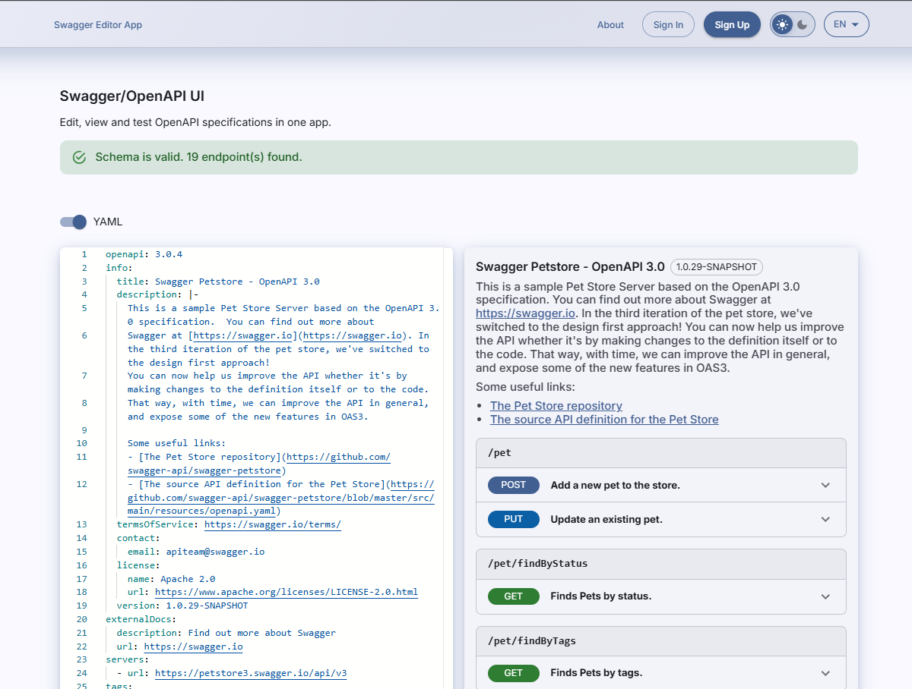

# Swagger Editor App

A web application for editing, viewing, and testing OpenAPI/Swagger specifications in one place.

**[Live demo](https://swagger-editor-app-alpha.vercel.app)** · Built as a team project (3 people) for the RS School React course.



> To try it with a real spec, paste the [Petstore schema](https://raw.githubusercontent.com/swagger-api/swagger-petstore/master/src/main/resources/openapi.yaml) into the editor.

## Features

- **Editor** - load and edit OpenAPI/Swagger schemas in JSON or YAML, with automatic format detection, conversion between formats, and real-time validation with error indication
- **Viewer** - endpoints grouped by path and method, with parameters, request and response schemas, and all documented status codes
- **Media types** - switch between the content types declared in the spec; the schema and the examples from the spec update accordingly
- **Generated examples** - for JSON payloads, when the spec has no explicit example, one is built from the schema and used to prefill the request body
- **Try It Out** - send requests to any external API through a server-side proxy, which removes CORS restrictions
- **cURL** - generate a cURL command from the current request state and copy it to the clipboard
- **Accounts** - sign up and sign in to save your last schema and keep a history of executed requests
- **History and analytics** - server-rendered list of past requests with duration, status code, method, request and response sizes, and errors
- **Interface** - responsive split view that adapts to screen orientation, light and dark themes, English and Russian locales

## How the proxy works

CORS is a browser policy, so a request from the browser to an arbitrary API is blocked before the response is read. Instead, the app posts the request details to its own Route Handler, which performs the HTTP call server-side and returns the status, headers and body.

An open proxy would be an SSRF hole, so it rejects private and link-local addresses, pins the resolved IP for the connection, keeps redirects within one origin, and applies a timeout and a response size limit.

## Tech stack

- Next.js 16 (App Router), React 19 with the React Compiler
- TypeScript in strict mode, no `any` or `@ts-ignore`
- MUI v9, Monaco Editor, react-markdown
- Supabase for authentication and storage
- React Hook Form with Zod, next-intl
- Vitest and React Testing Library - 92% statement coverage
- ESLint, Prettier, husky, lint-staged, commitlint
- Deployed on Vercel

## Project structure

```
src/
├── app/              # App Router routes and API handlers
├── components/       # UI components, grouped by feature
├── constants/        # routes, brand, default schema
├── hooks/            # shared React hooks
├── i18n/             # locales and routing
├── lib/              # Supabase clients
├── providers/        # theme, toasts, auth context
├── services/         # schema persistence
├── theme/            # MUI theme
├── types/            # shared types
└── utils/            # schema parsing, network, history
```

## Getting started

### Installation

```bash
git clone https://github.com/AlyaEngineer/swagger-editor-app.git
cd swagger-editor-app
npm install
```

### Environment variables

Copy `.env.example` to `.env.local` and fill in your Supabase project credentials:

```bash
cp .env.example .env.local
```

- `NEXT_PUBLIC_SUPABASE_URL` - your Supabase project URL
- `NEXT_PUBLIC_SUPABASE_PUBLISHABLE_KEY` - your Supabase publishable (anon) key

Both values can be found in your Supabase project settings under API.

### Running locally

```bash
npm run dev
```

Open [http://localhost:3000](http://localhost:3000) to view the app.

### Scripts

```bash
npm run dev             # development server
npm run build           # production build
npm run test            # run tests
npm run test:coverage   # coverage report
npm run lint            # lint
npm run format          # format
```

## Team

- [Alla](https://github.com/AlyaEngineer) - team lead / frontend developer
- [Yulia](https://github.com/YuliaDemir) - frontend developer
- [Ivan](https://github.com/Ivan-khodorov) - frontend developer
